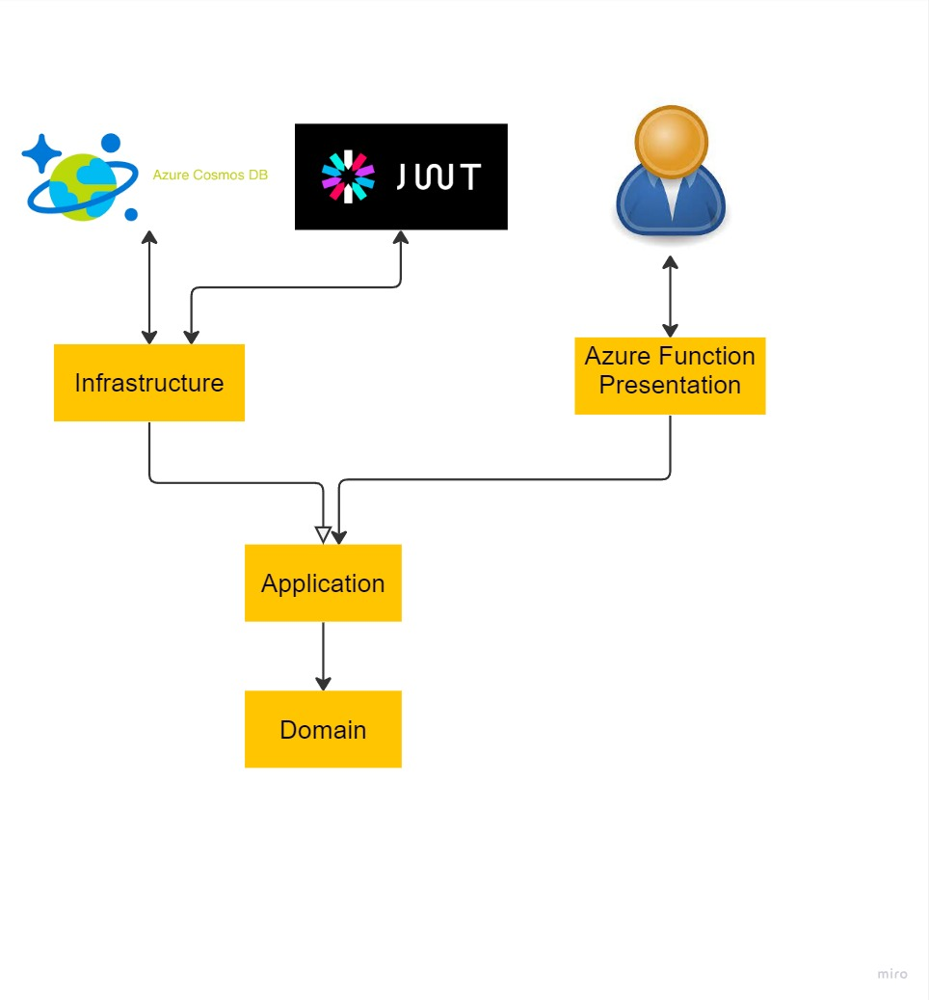
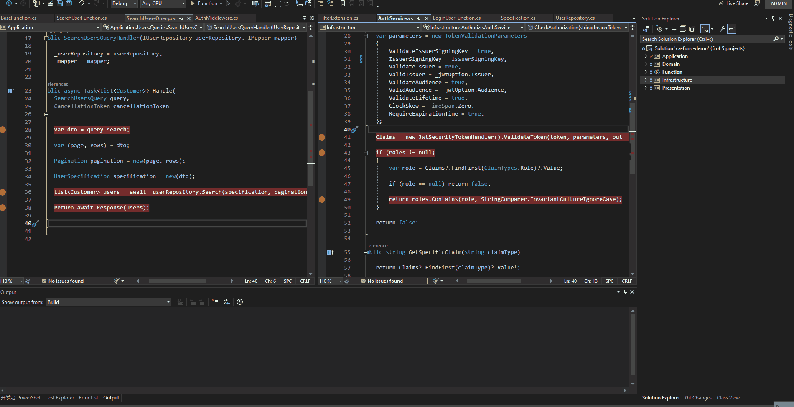
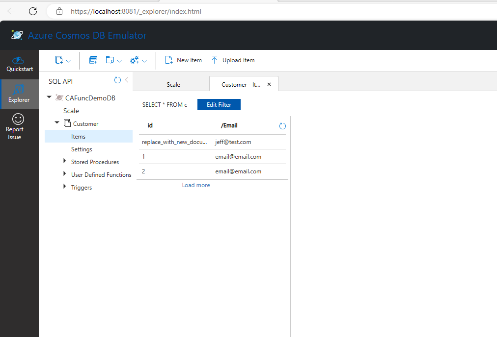

# CA Azure Function Demo






## Tech Stack
- [x] Azure Function
- [x] CA
- [x] FluentValidation
- [x] AutoMapper
- [x] OpenApi
- [x] Newtonsoft
- [x] Middleware
- [x] CosmosDB
- 
- [x] Scrutor
- [x] Jwt
- [x] Specification Pattern
- [x] Authentication
- [x] Authorization
- [x] AutoFixture
- [x] FluentAssertions
- [x] GuardClause
- [x] Unit/Integration Tests
```dotnetcli

$ mkdir ca-func-demo
$ cd ca-func-demo
$ dotnet new sln --name ca-func-demo

$ func init Function --worker-runtime dotnet-isolated

$ dotnet new classlib -o Domain
$ dotnet new classlib -o Application
$ dotnet new classlib -o Infrastructure
$ dotnet new classlib -o Presentation

$ dotnet add .\Application\ reference .\Domain\
$ dotnet add .\Infrastructure\ reference .\Application\
$ dotnet add .\Presentation\ reference .\Application\

$ dotnet sln add (ls -r **//*.csproj)

# FluentValidation
$ dotnet add .\Application\ package FluentValidation 
$ dotnet add .\Application\ package FluentValidation.DependencyInjectionExtensions 

# Scrutor 
$ dotnet add .\Infrastructure\ package Scrutor 

# Ardalis.GuardClauses
$ dotnet add .\Infrastructure\ package Ardalis.GuardClauses
$ dotnet add .\Application\ package Ardalis.GuardClauses

# AutoMapper
$ dotnet add .\Application\ package AutoMapper
$ dotnet add .\Application\ package AutoMapper.Extensions.Microsoft.DependencyInjection

# Azure.Cosmos
$ dotnet add .\Infrastructure\ package Microsoft.Azure.Cosmos

# jwt
$ dotnet add .\Infrastructure\ package System.IdentityModel.Tokens.Jwt

# OpenAPI
$ dotnet add .\Function\ package Microsoft.Azure.Functions.Worker.Extensions.OpenApi

$ cd Function
$ func new --template "Http Trigger" --name HttpTrigger-Demo
$ func new --name SearchUserFunction --template "HTTP trigger" --authlevel "anonymous"
$ func start
$ curl --get http://localhost:7071/api/HttpTrigger_Demo?name=JeffTest

# cosmo db emulator Download the Azure Cosmos DB emulator and run(in command prompt)
$ cd %ProgramFiles%\Azure Cosmos DB Emulator
$ Microsoft.Azure.Cosmos.Emulator.exe /Port=8081

https://localhost:8081/_explorer/index.html

# unit test
$ dotnet new xunit -o Application.Tests

$ dotnet add .\Application.Tests\ package Moq
$ dotnet add .\Application.Tests\ package FluentAssertions
$ dotnet add .\Application.Tests\ package AutoFixture.Xunit2

$ dotnet new xunit -o Infrastructure.Tests
$ dotnet new xunit -o Function.Tests
```